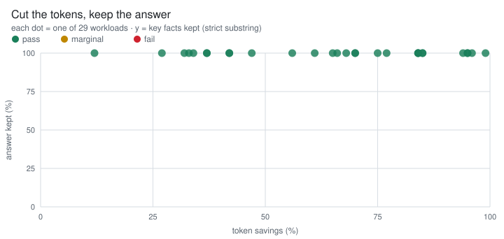

# Anyray Optimizer Benchmarks

[](https://github.com/anyrayHQ/benchmarks/actions/workflows/ci.yml)
[](package.json)
[](RESULTS.md)
[](QUALITY.md)

Each of the 29 real-world workloads here is a token-waste pattern real devs and agents
produce every day — pasting a whole log and asking one question, an agent re-reading
entire files, MCP tool-schema bloat, RAG over-fetching, resending the full session every
turn. These aren't inputs cherry-picked to flatter the optimizer; each is a waste pattern
the cost literature ranks as common and expensive (see [Why these workloads](#why-these-workloads)). Anyray
fixes them **on the request path, without touching the app**.

Every number is produced by running the **real optimizer** (the before-request
hook that sits on the gateway's hot path) over these workloads and measuring the
request it returns. Nothing is hand-typed: `./run.sh` writes the JSON in each
suite's `results/`, and the headline below is the sum of those files.

## Headline

Whole-request token reduction, measured by running each workload's hero strategy
through a live optimizer (accounting basis — see [Methodology](#methodology)):

| Suite | Workloads | Before (tok) | After (tok) | **Saved** |
|---|--:|--:|--:|--:|
| [`logs-and-data/`](logs-and-data/) | 6 | 160,048 | 11,377 | **93%** |
| [`code-context/`](code-context/) | 7 | 23,491 | 11,969 | **49%** |
| [`tools-and-rag/`](tools-and-rag/) | 6 | 17,775 | 5,706 | **68%** |
| [`agent-ops/`](agent-ops/) | 7 | 100,280 | 12,064 | **88%** |
| [`memory-recall/`](memory-recall/) | 3 | 37,239 | 2,350 | **94%** |
| **Total** | **29** | **338,833** | **43,466** | **87%** |
| [`guardrails/`](guardrails/) | 10 | *special accounting* | | *see suite* |

Three strategies carry most of this suite's input — `context_compression`,
`window_budget`, and `relevance_filter`, together ~80% of the tokens measured here.
That is a property of **these fixtures**, not a measurement of production traffic;
treat the per-strategy rows as "what each strategy does to a representative payload",
not as a weighted forecast of a given deployment's bill. Token counts use a
`chars / 4` estimate, so read the **percentage** as the headline (see
[Methodology](#methodology)). Full per-workload and per-strategy breakdowns are in
[RESULTS.md](RESULTS.md).

### What a default install gets

**The harness enables each workload's strategy before measuring it**, whatever the
optimizer ships as its default. That is the right way to measure one strategy in
isolation, and it means the total above is *not* what a stock deployment produces:

| | Share of measured savings |
|---|--:|
| strategies **on** by default | **63%** |
| strategies **off** by default (`window_budget` 27%, `output_externalize` 8%, `tool_pruning` 1%) | **37%** |

On the default-on subset alone the suite reads 222,238 → 34,884 tok, **84%**. The
opt-in strategies are off for reasons, not by oversight — `window_budget` crops whole
messages against a client-supplied ceiling, so it stays operator-enabled — and each
one is annotated in [`config.yaml`](config.yaml).

### What the headline does and doesn't sum

[COVERAGE.md](COVERAGE.md) shows this suite measures **22 of the 23** registered
strategies. The headline above is **not** the sum of those 22 — it sums the **11**
scored on whole-request bytes. The other 11 are measured on their own bases,
because a whole-request percentage would be meaningless or misleading for them:

| Scored how | Strategies | In the headline? |
|---|---|:-:|
| whole-request bytes (accounting) | `context_compression`, `window_budget`, `relevance_filter`, `output_externalize`, `code_graph`, `observation_mask`, `prompt_compression`, `tool_pruning`, `context_dedupe`, `command_digest`, `tool_schema_compression` | yes |
| own basis (guardrail / cache / diagnostic / vision) | `thinking_trim`, `cache_lint`, `cache_optimizer`, `semantic_cache`, `vision_ocr`, `param_tuning`, `provider_context_trim`, `reasoning_budget`, `output_shaping`, `content_census`, `context_quality` | no |

`thinking_trim` is the one to know about. It only touches replayed reasoning, so a
whole-request figure would mostly measure how much unrelated file body a fixture
carries; it is scored on replayed thinking tokens instead (**83%**, 719 → 121 tok in
[`43-thinking-replay`](agent-ops/)). On Anyray's own fleet it is currently the
**largest single source of optimizer savings** — so the headline omits the strategy
that, in production, saves the most. That is a property of the accounting basis, not
a gap in coverage, and it is the clearest reason to read this suite as *"what each
strategy does to a representative payload"* rather than as a forecast of a bill.

The one strategy with no workload at all is `audited_holdout`, which is not
benchmarkable here by construction: it is the unoptimized control marker, so it
transforms nothing and has no knob to pin.

### What it actually does

One real workload — [`logs-and-data/1-access-log`](logs-and-data/): paste a 500-line
nginx log and ask *"which requests are failing with 500s?"* (lines below are verbatim
from the payload, trimmed to width).

**Before — 26,153 tok** · every line billed:

```text
203.0.113.1  - - [10/Jun/2026:10:00:00] "GET  /api/orders/90000 HTTP/1.1" 404 …
198.51.100.7 - - [10/Jun/2026:10:00:03] "GET  /api/products      HTTP/1.1" 200 …
203.0.113.21 - - [10/Jun/2026:10:24:30] "POST /api/checkout      HTTP/1.1" 500 …
… 497 more lines, almost all 200/404 noise …
```

**After — 1,078 tok · 96% saved** · `relevance_filter` keeps the lines that answer it:

```text
203.0.113.21 - - [10/Jun/2026:10:24:30] "POST /api/checkout HTTP/1.1" 500 …
192.0.2.95   - - [10/Jun/2026:10:24:44] "POST /api/checkout HTTP/1.1" 500 …
… the failing 500 lines kept; the 200/404 noise elided (retrievable via /v1/retrieve) …
```

The model still names the failing endpoint, the `10:24:30`–`10:29:10` window, and the
client IPs — confirmed at 100% key-fact survival in [QUALITY.md](QUALITY.md).

<p align="center">
  <picture>
    <source media="(prefers-color-scheme: dark)" srcset="assets/quality-vs-savings.dark.svg" />
    
  </picture>
  <br />
  <sub>Savings buy nothing if the answer dies — so we check. 32 of 33 workloads keep 100% of their answer-bearing key facts; the one that does not is a tracked optimizer bug, left failing.</sub>
</p>

## Quality — does the answer survive?

Savings are only worth it if the model can still answer. For every workload we
define the **answer-bearing key facts** and check how many survive:

| | Workloads | PASS | MARGINAL | FAIL |
|---|--:|--:|--:|--:|
| Key-fact survival (strict substring, model-free) | 33 | 32 | 0 | 1 |

**The answer survives on 32 of 33.** The exception is `30-metrics-json`, where the
answering row sits past the 50-item head `context_compression` retains — a real
optimizer bug (ANY-133), kept as a failing row rather than tuned away. The
per-workload table is in **[QUALITY.md](QUALITY.md)**.

The strict check is the floor, and it is the one that needs no model: `run_quality.mjs`
scores it against the optimizer alone, so anyone can reproduce it. The optional
semantic-judge lane (`--judge`) has **not** been re-run against the current optimizer,
so no judge verdicts are committed — an old verdict describes a differently-trimmed
context and would be worse than none.

## Why these workloads

These aren't synthetic stress tests picked to make an optimizer look good. Every
one is a token-waste pattern that the 2025–2026 AI-cost literature consistently
ranks as among the most common — and most expensive — things developers and
coding agents do. **79% of enterprises overran their AI budgets last year**, and
the same culprits show up every time. We benchmark Anyray on exactly those.

| Waste pattern — what devs / agents actually do | What the cost research reports | Suite |
|---|---|---|
| Paste a whole log or data dump and ask one question | the single most common thing engineers do with an assistant — the file is billed in full, every turn | `logs-and-data` |
| Agents re-read entire files when the question needs signatures, not bodies | **~70%** of a coding agent's tokens are irrelevant file reads | `code-context` |
| MCP tool-schema bloat rides along every call | **55k+ tokens** of tool definitions before the first message | `tools-and-rag` |
| RAG over-retrieval | **3–5×** more chunks fetched than the answer uses | `tools-and-rag` |
| The same instruction block re-pasted per item | repeated boilerplate billed once per item | `tools-and-rag` |
| Agents resend the whole history every turn (context re-accumulation) | the **#1** researched waste pattern — agents use **4–15×** chat tokens; a 50-turn coding session bills ~**25:1** input:output | `agent-ops` |
| Command / test output read back verbatim | runner output is mostly passing lines + banners | `agent-ops` |
| Recall a large store (sessions, decisions, notes) for a narrow question | recall-heavy assistant + agent usage | `memory-recall` |
| Redundant / near-duplicate requests | **40–60%** of enterprise LLM traffic is repetitive (**18%** exact duplicates, **~47%** semantically similar) | `guardrails` (cache) |
| Pasted screenshots billed as vision tokens | text-bearing images cost far more than their extracted text | `guardrails` (OCR) |
| Runaway output ceilings / over-generation | uncapped `max_tokens` inflates worst-case spend | `guardrails` (param) |

*(Figures are the patterns the 2025–2026 industry cost research surfaces
repeatedly; they motivate the workload selection, they are not themselves Anyray
measurements. Anyray's measurements are the [headline](#headline) and
[RESULTS.md](RESULTS.md).)*

Waste patterns we **don't** yet have a strategy for — named so the scope is honest:
model overkill (routing trivial calls to cheaper models), retry storms /
duplicate-call debouncing, and provider prompt-cache shaping.

## Benchmarks

Each suite is a directory of payloads plus the strategy that targets that waste
pattern. The "hero strategy" is the one Anyray reaches for first on that shape of
request.

| Suite | Workloads | Hero strategies | What it measures |
|---|---|---|---|
| [`logs-and-data/`](logs-and-data/) | 6 | `context_compression`, `relevance_filter` | A log/data/JSON blob (often a tool result) + a narrow question → minify, array-cap, keep the lines that answer it |
| [`code-context/`](code-context/) | 7 | `code_graph`, `relevance_filter`, `context_compression` | Source/diff/search read back (file reads via tool results) → keep the navigable reference graph, elide bodies |
| [`tools-and-rag/`](tools-and-rag/) | 6 | `tool_pruning`, `tool_schema_compression`, `relevance_filter`, `prompt_compression` | Tool-schema bloat, verbose schema prose, over-fetched chunks, re-pasted boilerplate |
| [`agent-ops/`](agent-ops/) | 8 | `window_budget`, `relevance_filter`, `command_digest`, `context_dedupe`, `thinking_trim` | Triage dumps, long tool-call sessions that overflow the window, verbatim test output, re-read files, replayed reasoning |
| [`memory-recall/`](memory-recall/) | 3 | `relevance_filter`, `observation_mask`, `output_externalize` | A large recalled store + a "remember this for me" question; stale trajectories; durable blobs |
| [`guardrails/`](guardrails/) | 10 | `semantic_cache`, `vision_ocr`, `param_tuning`, `cache_optimizer`, `context_quality`, `content_census`, `provider_context_trim`, `reasoning_budget`, `output_shaping`, `cache_lint` | Repeated calls, pasted screenshots, runaway ceilings, cache-prefix stability, context health, content census, provider-side trim, reasoning downshift, output shaping, prefix churn |

The optimizer is **reversible**: every elided span is stashed behind a retrieval
handle (`POST /v1/retrieve`), so the model can pull
back anything it turns out to need. Most strategies re-rank and elide rather than
paraphrase — so the saving comes from dropping what the live question doesn't
touch, not from lossy rewriting; a few (`command_digest`, `tool_schema_compression`)
rewrite deterministically and idempotently. See [Does it preserve the
answer?](#does-it-preserve-the-answer)

## Methodology

The harness turns each workload into two configs — the Anyray analog of a
compression benchmark's `control` vs `model--aggressiveness`:

- **`control`** — the raw request, optimizer bypassed. Establishes the baseline token count.
- **`optimized`** — the suite's hero strategy, pinned at a single knob, run by a live optimizer.

For each workload the harness:

1. `PUT /admin/optimizer/settings` to pin exactly one strategy at one knob (so the
   saving is attributable to a named strategy, not the whole pipeline).
2. `POST /v1/optimize` with the payload, and reads back the transformed request.
3. Measures **whole-request size**: the character length of every message body
   plus the tools schema, before and after.

The token figure is `chars / 4` (the basis the optimizer itself uses; set in
`config.yaml`). The **savings percentage is the reliable signal** — it's confirmed
against a real BPE tokenizer (`tiktoken`) and the optimizer's own calibrated
estimator; the absolute counts are a conservative estimate (~1.2–1.8× below real
provider tokens on dense logs/JSON). A real-provider cross-check is in
[RESULTS.md](RESULTS.md); a built-in `--live-bill` mode is on the
[roadmap](RESULTS.md#roadmap).

**Content-free, by construction.** The harness records only sizes and the
optimizer's own one-line decision strings — never message bodies. That mirrors
Anyray's core invariant: prompt/response *content* is never logged. Every payload
in this repo is **synthetic**.

## Prerequisites

- Node.js 20+
- A reachable Anyray optimizer (the before-request hook). The Anyray stack brings
  one up in-network on `:8088` — `docker compose up` from the
  [Anyray install repo](https://github.com/anyrayHQ/install). Any reachable
  instance works.
- The optimizer's admin token (`ANYRAY_ADMIN_TOKEN`) — the same key that gates the
  Anyray console. The harness uses it to pin one strategy per workload.

## Setup

```bash
cp .env.example .env
# Edit .env: ANYRAY_OPTIMIZER_URL and ANYRAY_ADMIN_TOKEN
```

`./run.sh` installs dependencies (`js-yaml`) and loads `.env` on first run.

## Configuration

All settings live in [`config.yaml`](config.yaml):

- **`shared`** — optimizer URL, admin-token env var (and an optional
  optimizer-token env var for hardened optimizers that gate `/v1/optimize`), the
  chars-per-token accounting basis, request timeout.
- **`benchmarks`** — one entry per suite; each lists its workloads, and each
  workload names its `strategy` and `params` (the knob). To benchmark a strategy
  at a different aggressiveness, change its `params` and re-run.

## Running a benchmark

```bash
cd memory-recall && ./run.sh          # one suite
./run.sh --all                        # every suite
```

### Options

```bash
./run.sh --suite code-context                      # one suite by name
./run.sh --suite code-context --workload 15-multifile-graph   # one workload
./run.sh --all --limit 2                           # first 2 workloads per suite (smoke test)
```

### Resume support

Interrupted? Re-run the same command. Workloads already present in
`results/optimized.json` are skipped.

## Results

Each suite writes `results/control.json` and `results/optimized.json` — an array
over the suite's workloads, re-saved per item (so a run resumes cleanly). Each
`optimized` row carries the strategy, knob, before/after chars and tokens, percent
saved, and the optimizer's decision strings. These files are **committed** — they
are the real, reproducible scores. The aggregate is [RESULTS.md](RESULTS.md).

## Does it preserve the answer?

Usually, and the suite is built to show where it does not. The
[**quality benchmark**](QUALITY.md) defines the answer-bearing key facts for each
workload and checks how many survive: **32 of 33 by strict substring**.

The one failure is real and deliberately kept. [`30-metrics-json`](logs-and-data/)
asks which timestamp shows a p99 spike; the answering row sits at array index 305.
`context_compression` retains the first 50 items of a JSON array, so the model gets
50 unremarkable rows plus an elision marker, and answers confidently from data that
no longer contains the answer. Moving the incident into the retained head would
score 100% and measure nothing. Tracked as ANY-133.

Anyray's strategies are also reversible — every elided span is retrievable on demand
(`POST /v1/retrieve`) — so even a partial trim is recoverable.

Run it with `node run_quality.mjs --all` (strict survival, needs only the optimizer)
and `--judge` for the optional semantic pass, which needs a model.

## What this does and doesn't measure

- **Does:** input-token reduction per workload, per strategy, reproducibly — **and**
  answer-quality (key-fact survival) per workload.
- **Doesn't (yet):** latency added by the hook (the optimizer fails open past
  `ANYRAY_OPTIMIZER_TIMEOUT_MS`); output-token cost (except the `param_tuning`
  guardrail, which clamps the output ceiling). See [RESULTS.md](RESULTS.md#roadmap).

---

Built on the Anyray optimizer. Learn more at [anyray.ai](https://anyray.ai) ·
[docs](https://docs.anyray.ai).
